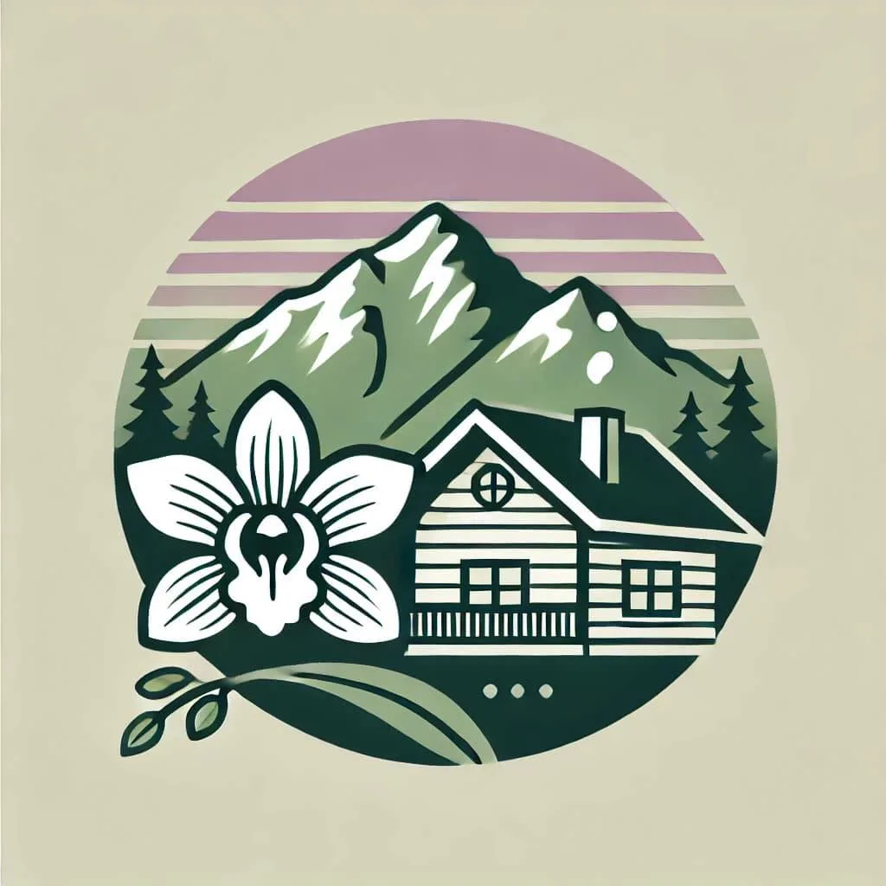
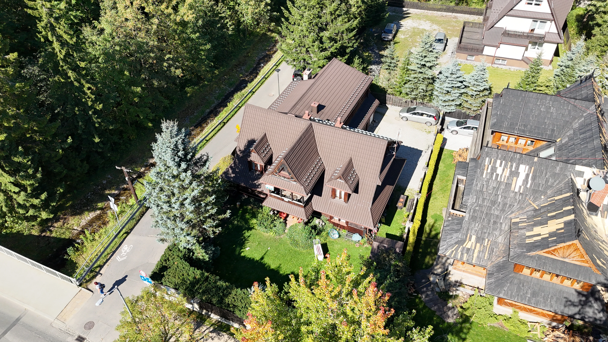

<p align="center">
  
</p>

<h1 align="center">Willa Storczyk Zakopane</h1>

<p align="center">
  <strong>Strona internetowa pensjonatu w sercu Zakopanego</strong><br>
  <a href="https://storczykzakopane.pl">storczykzakopane.pl</a>
</p>

<p align="center">
  
  
  
  
</p>

---

## O projekcie

Statyczna, w pełni responsywna strona internetowa dla **Willi Storczyk** — przytulnego pensjonatu położonego w centrum Zakopanego, blisko Krupówek i szlaków tatrzańskich. Strona zaprojektowana z myślą o szybkości, SEO i profesjonalnym wyglądzie.

<p align="center">
  
</p>

## Funkcje

| Funkcja | Opis |
|---------|------|
| **Frosted Glass UI** | Spójny design z efektem matowego szkła (backdrop-filter) |
| **Responsywność** | Mobile-first, dedykowana nawigacja mobilna (wyspa + bottom nav) |
| **Galeria ze zdjęciami** | Lightbox z nawigacją klawiaturową i gestami swipe |
| **Formularz rezerwacji** | Obsługiwany przez Netlify Forms z reCAPTCHA |
| **Blog** | 7 artykułów o atrakcjach Zakopanego |
| **SEO** | Schema.org (LodgingBusiness), Open Graph, sitemap.xml |
| **Szybkość** | Obrazy WebP, lazy loading, zero frameworków |

## Struktura

```
.
├── index.html              # Strona główna
├── blog.html               # Lista artykułów blogowych
├── blog-*.html             # 7 artykułów (Kasprowy, Krupówki, Gubałówka...)
├── regulamin.html          # Polityka prywatności
├── robots.txt
├── sitemap.xml
└── zdj/                    # Zdjęcia i grafiki
    ├── index-img*.webp     # Zdjęcia strony głównej i galerii
    ├── blog-*-img*.webp    # Zdjęcia do artykułów
    └── photo_*.jpg         # Zdjęcia pokoi
```

## Technologie

- **HTML5 + CSS3** — cały projekt w czystym HTML/CSS, bez frameworków
- **Vanilla JavaScript** — lightbox, karuzele, mobile nav, formularz
- **Netlify** — hosting i obsługa formularza kontaktowego
- **Google Fonts** — Playfair Display + Lato

## Uruchomienie lokalnie

```bash
# Sklonuj repozytorium
git clone https://github.com/Jedrek11/Storczyk-Zakopane-Website.git

# Otwórz w przeglądarce
cd Storczyk-Zakopane-Website
start index.html
```

Lub użyj dowolnego lokalnego serwera:
```bash
npx serve .
```

## Kontakt

- **Adres:** Droga na Bystre 1, 34-500 Zakopane
- **Telefon:** 607 312 972
- **Strona:** [storczykzakopane.pl](https://storczykzakopane.pl)

<p align="center">
  <a href="https://www.facebook.com/share/1KkBXUvRLa/">Facebook</a> ·
  <a href="https://www.instagram.com/storczykzakopane">Instagram</a> ·
  <a href="https://www.tiktok.com/@storczykzakopane">TikTok</a> ·
  <a href="https://maps.app.goo.gl/RG8Byvs9u7my1c5TV">Google Maps</a>
</p>

---

<p align="center"><sub>Made with care in Zakopane</sub></p>
