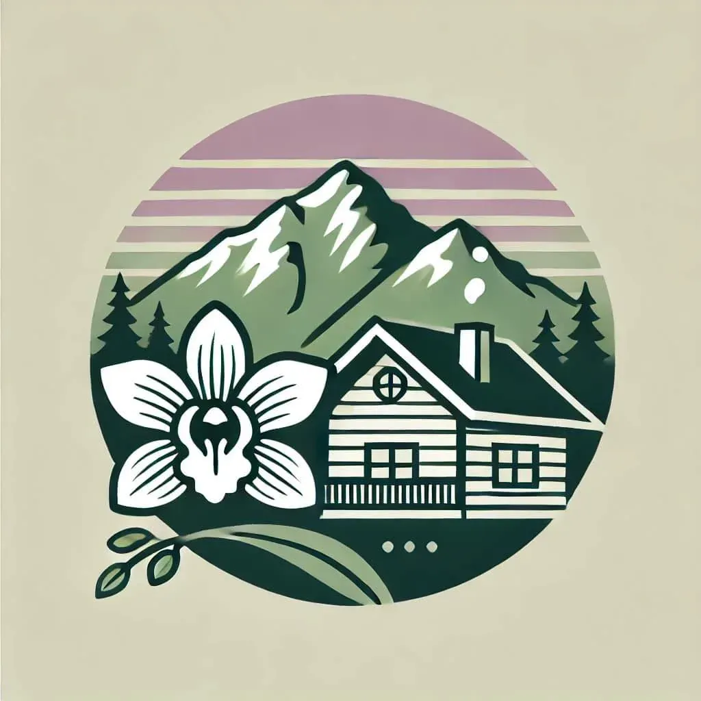

<p align="center">
  
</p>

<h1 align="center">Willa Storczyk Zakopane</h1>

<p align="center">
  <strong>Strona internetowa pensjonatu w sercu Zakopanego</strong><br>
  <a href="https://storczykzakopane.pl">storczykzakopane.pl</a>
</p>

<p align="center">
  
  
  
  
</p>

---

## O projekcie

Statyczna, w pełni responsywna strona internetowa dla **Willi Storczyk** — przytulnego pensjonatu w centrum Zakopanego, blisko Krupówek i szlaków tatrzańskich.

## Uruchomienie lokalne

```bash
# Wymagania: Node.js >= 14 (brak zewnętrznych zależności)

# Build — generuje strony z szablonów src/ + partials/
npm run build

# Watch — automatyczny rebuild przy każdej zmianie
npm run watch
```

**Nie edytuj plików .html w katalogu głównym** — są generowane automatycznie przez build. Edytuj zawsze w `src/` lub `partials/`.

## Struktura projektu

```
.
├── src/                        # Szablony stron (edytuj tutaj)
│   ├── index.html              #   Strona główna
│   ├── blog.html               #   Lista artykułów
│   ├── blog-*.html             #   7 artykułów (Kasprowy, Krupówki, Gubałówka...)
│   └── regulamin.html          #   Polityka prywatności
│
├── partials/                   # Wspólne elementy (menu, nawigacja)
│   ├── mobile-menu-index.html  #   Menu mobilne — strona główna
│   ├── mobile-menu-blog.html   #   Menu mobilne — blog
│   ├── mobile-menu-styles.html #   Style CSS menu
│   ├── mobile-topbar.html      #   Górny pasek (blog)
│   ├── bottom-nav-*.html       #   Dolna nawigacja
│
├── assets/                     # Statyczne zasoby
│   ├── css/main.css            #   Główny arkusz stylów
│   ├── css/aos.css             #   AOS (animacje scroll)
│   ├── js/main.js              #   Cały JavaScript strony
│   ├── js/aos.js               #   AOS library
│   ├── icons/                  #   Ikony SVG
│   ├── logo.webp               #   Logo willi
│   └── willa-storczyk.webp     #   Zdjęcie główne (OG/meta)
│
├── fonts/                      # Fonty (self-hosted)
│   ├── google-fonts.css        #   Playfair Display + Lato
│   └── font-*.woff2            #   Pliki fontów
│
├── zdj/                        # Zdjęcia
│   ├── gallery/                #   Galeria pokoi, slajdy, hero
│   ├── blog/                   #   Zdjęcia do artykułów blogowych
│   └── okolica/                #   Zdjęcia okolicy (Tatry, Zakopane)
│
├── scripts/                    # Narzędzia deweloperskie
│   ├── build.js                #   Build — łączy src/ + partials/ → HTML
│   ├── watch.js                #   Auto-rebuild przy zmianach
│   └── new-blog.js             #   Generator nowych artykułów
│
├── config.json                 # Dane kontaktowe, URL-e, adresy
├── netlify.toml                # Cache headers i konfiguracja Netlify
├── sitemap.xml                 # Mapa strony
└── robots.txt                  # Instrukcje dla crawlerów
```

## Funkcje

| Funkcja | Opis |
|---------|------|
| **Frosted Glass UI** | Spójny design z efektem matowego szkła (backdrop-filter) |
| **Responsywność** | Mobile-first, dedykowana nawigacja mobilna (wyspa + bottom nav) |
| **Galeria** | Lightbox z nawigacją klawiaturową, swipe i pinch-to-zoom |
| **Formularz rezerwacji** | Netlify Forms z reCAPTCHA i walidacją |
| **Blog** | 7 artykułów o atrakcjach Zakopanego |
| **SEO** | Schema.org (LodgingBusiness + FAQPage), Open Graph, sitemap.xml |
| **Szybkość** | Self-hosted fonty, obrazy WebP, lazy loading, zero frameworków |
| **Cache** | Agresywne cache headers (immutable) dla statycznych zasobów |
| **Typografia** | Automatyczne niełamliwe spacje przy polskich spójnikach |

## Technologie

- **HTML5 + CSS3** — czysty HTML/CSS, bez frameworków
- **Vanilla JavaScript** — lightbox, karuzele, mobile nav, formularz, typewriter
- **Netlify** — hosting, formularze, cache headers
- **Self-hosted fonty** — Playfair Display + Lato (zero zapytań do Google)

## Kontakt

- **Adres:** Droga na Bystre 1, 34-500 Zakopane
- **Telefon:** 607 312 972
- **E-mail:** storczykzakopane@gmail.com
- **Strona:** [storczykzakopane.pl](https://storczykzakopane.pl)

<p align="center">
  <a href="https://www.facebook.com/profile.php?id=61576000020623">Facebook</a> ·
  <a href="https://www.instagram.com/storczykzakopane">Instagram</a> ·
  <a href="https://www.tiktok.com/@storczykzakopane">TikTok</a> ·
  <a href="https://maps.app.goo.gl/RG8Byvs9u7my1c5TV">Google Maps</a>
</p>

---

<p align="center"><sub>Made with care in Zakopane</sub></p>
